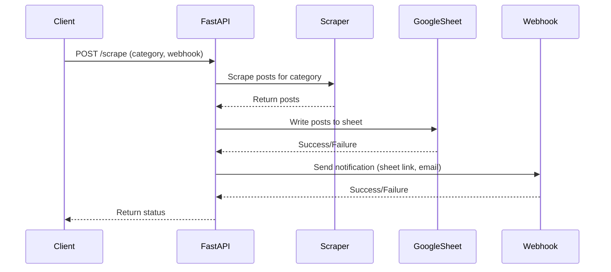

# Scraper + API

This project provides an API endpoint to scrape blog posts by category from Xepelin Blog, write the results to a Google Sheet, and notify a webhook when the process is complete.

- The scraper code can be found in the `app/scraper.py` file.
- The Google Sheet write code can be found in the `app/google_sheet_writing.py` file.
- The webhook code can be found in the `app/webhook.py` file.

